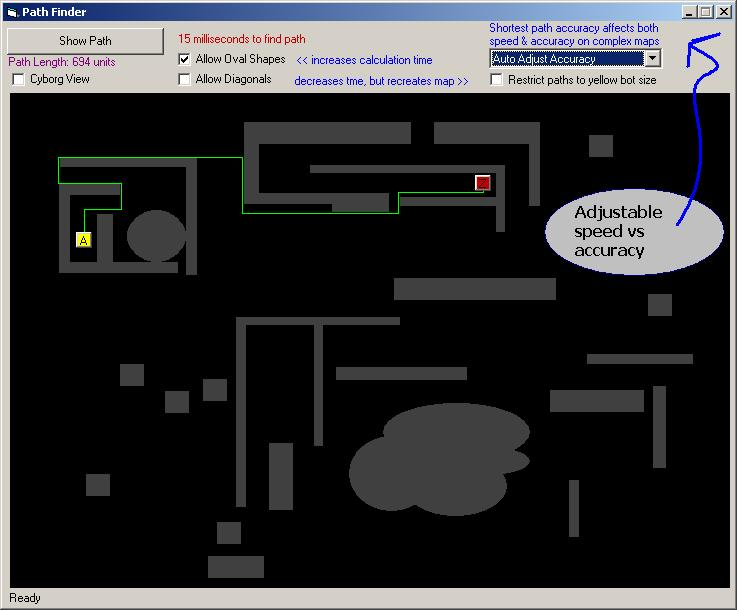



## LaVolpe PathFinder \(OverClocked\)

### Description

AI pathfinder for large maps - 2nd try. This is a unique approach and is fastest version I have to date. Submitted for your suggestions & feedback. Well commented. If anyone has seen an approach like this, please let me know. I would like to compare distance & heuristic calculations. Unlike most pathfinders, this one does not require fixed objects and can be used for quickly plotting paths btwn moving objects. For those of you that have personally requested to be updated on improvements to this code, I have sent you a personal copy. For all others, I have re-posted this project simply because the update produces a significantly faster result & is far more accurate to providing a shorter path. I'm sure this project can be tweaked to provide even faster results, but keep in mind the trade-off between speed and overtasking memory resources. Updated again for to allow user-defined accuracy and speed (use the AccuracyPct variable in routine: CreatePaths) 1 Feb 20:10 CST -- Now can find shortest path 100% of time & quickly.
 
### More Info
 

             |
---                |---
**Submitted On**   |2004-02-01 19:56:36
**By**             |[LaVolpe](https://github.com/Planet-Source-Code/PSCIndex/blob/master/ByAuthor/lavolpe.md)
**Level**          |Advanced
**User Rating**    |5.0 (175 globes from 35 users)
**Compatibility**  |VB 6\.0
**Category**       |[Graphics](https://github.com/Planet-Source-Code/PSCIndex/blob/master/ByCategory/graphics__1-46.md)
**World**          |[Visual Basic](https://github.com/Planet-Source-Code/PSCIndex/blob/master/ByWorld/visual-basic.md)
**Archive File**   |[LaVolpe\_Pa170289222004\.zip](https://github.com/Planet-Source-Code/lavolpe-lavolpe-pathfinder-overclocked__1-50278/archive/master.zip)

